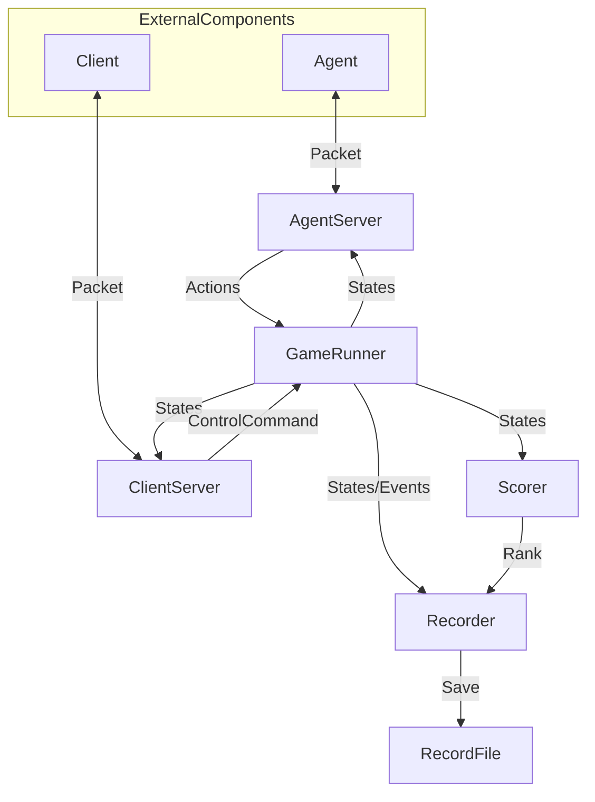

# THUAI7 游戏服务端

## 整体架构



## 组件

### AgentServer

从 GameRunner 获取游戏状态并发送至 Agent; 接收来自 Agent 的消息并将其转换为玩家操作。

需要单独的线程。

#### 属性

*如有需要，可添加、删除、修改。*

```csharp
Dictionary<int, IPlayer> PortsOfPlayers
// 玩家与端口的对应关系。

float FrequencyOfReceivingMessage
// 每秒接收多少次消息。
```

#### 方法

*如有需要，可添加、删除、修改。*

```csharp
void OpenPort(int port)
{
    // 开启端口。
}

void ClosePort(int port)
{
    // 关闭端口。
}

void SendMessage(IMessage message, int port)
{
    // 向指定端口发送消息。
    // 消息内容参见痛通信协议。
}

Task TaskForReceivingMessage
{
    // 定时接收消息。
    // 消息内容参见通信协议。
    // 每个端口需要单独的线程。
}

void HandleAfterNewGameTickEvent(...)
{
    // 将游戏状态整理成消息，并发送给 Agent。
    // 建议作为 Game.AfterNewGameTickEvent 的处理器。
}
```

#### 事件

*如有需要，可添加、删除、修改。*

```csharp
AfterReceivingMessageEvent
// 收到消息时触发。
// 建议为其添加处理器，用于将消息转换成玩家操作并调用 Player 中对应函数。
```

### ClientServer

若客户端设置为实时播放模式并连接至服务端，则可接收客户端消息以控制游戏运行，并向客户端发送游戏状态。

需要单独的线程。

#### 属性

*如有需要，可添加、删除、修改。*

```csharp
int port
// 使用的端口。
```

#### 方法

*如有需要，可添加、删除、修改。*

```csharp
void Open()
{
    // 开启端口。
}
void Close()
{
    // 关闭端口。
}
void SendMessage(IMessage message, int port)
{
    // 向指定端口发送消息。
    // 消息内容参见痛通信协议。
}
Task TaskForReceivingMessage
{
    // 定时接收消息。
    // 消息内容参见通信协议。
    // 每个端口需要单独的线程。
}

void HandleAfterNewGameTickEvent(...)
{
    // 将游戏状态整理成消息，并发送给客户端。
    // 建议作为 Game.AfterNewGameTickEvent 的处理器。
}

void HandleAfterReceivingMessageEvent(...)
{
    // 根据消息内容，控制游戏的开始与停止。
    // 建议作为此组件的 AfterReceivingMessageEvent 的处理器。
}
```

#### 事件

*如有需要，可添加、删除、修改。*

```csharp
AfterReceivingMessageEvent
// 收到消息时触发
```

### GameRunner

控制游戏 (Game) 的开始和停止。

关于 Game 内部的组件，见 [Game](Game.md)

#### 属性

*如有需要，可添加、删除、修改。*

```csharp
IGame Game
// 游戏逻辑在此运行。

float TicksPerSecond
// 每秒运行多少个游戏刻。
```

#### 方法

*如有需要，可添加、删除、修改。*

```csharp
void Start()
{
    // 开始游戏。
}

void Stop()
{
    // 终止游戏。
}

void Reset()
{
    // 重置游戏。
}

Task TaskForRunningGame
{
    // 开始游戏后每隔一段时间运行一个游戏刻。
    // 需要单独的线程。
}

void HandleBattleEndEvent(...)
{
    // 在战斗结束（决出胜者或平局或由于异常导致无法进行）时终止游戏。
    // 建议作为 Game.AfterBattleEndsEvent 的处理器。
}
```

#### 事件

*如有需要，可添加、删除、修改。*

```csharp
AfterGameStartEvent
// 游戏开始时触发。

AfterGameStopEvent
// 游戏终止时触发。

AfterGameResetEvent
// 游戏重置时触发。
```

### Scorer

计分器，本项目中主要记录各玩家的名次。

#### 属性

*如有需要，可添加、删除、修改。*

```csharp
Dictionary<int, int> Ranks
// 玩家 ID 与对应的名次。
```

#### 方法

*如有需要，可添加、删除、修改。*

```csharp
void UpdateRank(...)
{
    // 更新玩家名次。
    // 建议作为 Game.AfterNewGameTickEvent 的处理器。
}
```

#### 事件

*如有需要，可添加、删除、修改。*

```csharp
```

### Recorder

记录对局，可由客户端播放。

#### 属性

*如有需要，可添加、删除、修改。*

```csharp
string FileName
// 文件名称。
```

#### 方法

*如有需要，可添加、删除、修改。*

```csharp
// 记录格式参见通信协议。
// 建议记录初始状态和关键事件。

void RecordState(...)
{
    // 记录当前游戏状态。
    // 建议作为 GameRunner.AfterGameStartEventArgs 的处理器。
}

void RecordEvent(EventArgs e)
{
    // 记录某一事件。
}
```

#### 事件

*如有需要，可添加、删除、修改。*

```csharp
```

## 开发人员

*以“组件名称：开发者”的格式写在此目录下。*
