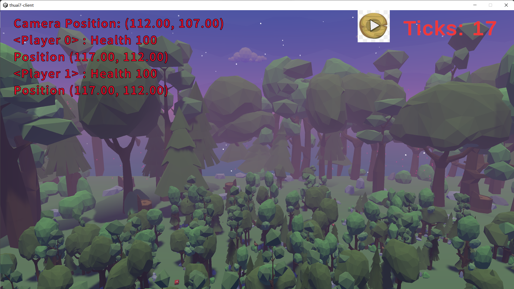

# THUAI7 前端使用指南

欢迎您使用我们的前端回放工具，以下是详细的使用步骤和说明，帮助您更好地理解和操作。请在我们的 Release 中根据您的操作系统版本下载最新的前端，链接如下：[https://github.com/thuasta/thuai-7/releases](https://github.com/thuasta/thuai-7/releases)。

## 启动与文件读取

当您点击“Start”按钮后，前端将自动开始工作，它会读取“Records”文件夹下的文件。这些文件记录了游戏的回放数据，供您随时查看和回放。

## 文件选择与进入回放场景

在读取完文件后，您可以在界面上看到所有的文件列表。点击您想要查看的文件，即可进入对应的回放场景。场景示例如下：

## 观察模式切换

在回放场景中，您可以通过点击鼠标左键来切换观察模式。我们提供了两种观察模式供您选择：

1. 自由观察模式：在这种模式下，您可以自由控制视角的移动。按下“WASD”键可以实现视角的平移，同时，按住鼠标右键并滑动鼠标可以旋转视角，让您全方位地观察场景。

2. 观察玩家模式：如果您想专注于某个玩家的行动，可以选择此模式。在此模式下，视角将自动跟随选定的玩家移动，您只需滑动鼠标滚轮即可实现与玩家之间的距离缩放，方便您更清晰地观察玩家的行动。

## 场景元素与玩家信息

在回放场景中，您会看到一些障碍物（Walls）。这些障碍物是随机生成的，其中中间低矮的障碍物代表了真实的地图，而地图外高大的障碍物则是用作装饰，使场景更加丰富和立体。

在界面的左上角，您可以看到玩家的部分信息，包括其名称、状态等，方便您了解玩家的基本情况。同时，在界面的右上角，我们提供了播放控制按钮，包括开始、暂停以及当前游戏的Ticks，让您可以方便地控制回放的进度。

希望这份前端使用指南能帮助您更好地使用这个工具，享受愉快的回放体验！