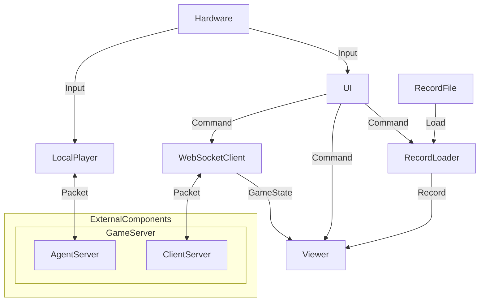

# THUAI7 游戏客户端

## 整体架构



## 组件

### UI

为玩家提供操作界面。

#### 属性

*如有需要，可添加、删除、修改。*

```csharp
```

#### 方法

*如有需要，可添加、删除、修改。*

```csharp
```

#### 事件

*如有需要，可添加、删除、修改。*

```csharp
```

### WebSocketClient

在实时播放模式下，向服务端发送控制命令，并从服务端接收游戏状态。

#### 属性

*如有需要，可添加、删除、修改。*

```csharp
```

#### 方法

*如有需要，可添加、删除、修改。*

```csharp
```

#### 事件

*如有需要，可添加、删除、修改。*

```csharp
```

### RecordLoader

在回放模式下，获取可加载的记录文件；具有加载指定记录文件的功能。

#### 属性

*如有需要，可添加、删除、修改。*

```csharp
```

#### 方法

*如有需要，可添加、删除、修改。*

```csharp
```

#### 事件

*如有需要，可添加、删除、修改。*

```csharp
```

### Viewer

在回放模式下，播放已加载的回放文件。

在实时播放模式下，展示用户所操控角色（本地玩家）视角。

#### 属性

*如有需要，可添加、删除、修改。*

```csharp
```

#### 方法

*如有需要，可添加、删除、修改。*

```csharp
```

#### 事件

*如有需要，可添加、删除、修改。*

```csharp
```

### LocalPlayer

可通过硬件操控。

#### 属性

*如有需要，可添加、删除、修改。*

```csharp
```

#### 方法

*如有需要，可添加、删除、修改。*

```csharp
```

#### 事件

*如有需要，可添加、删除、修改。*

```csharp
```

## 开发人员

*以“组件名称：开发者”的格式写在此目录下。*
