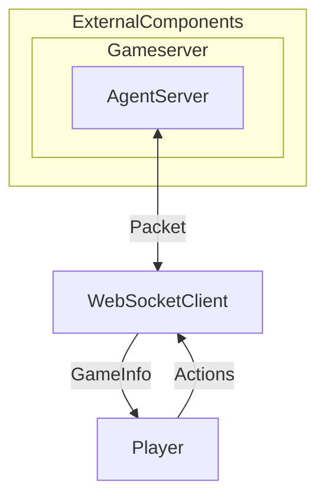

# THUAI7 游戏Sdk

## 整体架构



## 组件

*若使用的语言无事件机制，可考虑在应触发事件的位置直接调用对应的处理器。*

### WebSocketClient

与 AgentServer 建立 WebSocket 通信，接收玩家所需的游戏状态，并向服务端发送玩家操作。

#### 属性

*如有需要，可添加、删除、修改。*

```csharp
ConcurrentQueue<IMessage> MessageQueue
// 待发送的消息。

float FrequencyOfReceivingMessage
// 每秒接收多少次消息。
```

#### 方法

*如有需要，可添加、删除、修改。*

```csharp
void Connect(string IpAddress, int port)
{
    // 连接指定的 IP 地址和端口。
}

void Send(IMessage Message)
{
    // 向服务端发送消息。
    // 需要发送的具体内容参见通信协议。
}

Task TaskForReceivingMessage
{
    // 定时接收消息。
    // 需要单独的线程。
}

void HandleAfterPlayerActionEvent(...)
{
    // 将玩家行动转换为消息并发送。
    // 玩家行动对应的消息参见通信协议。
    // 建议作为 Player 相关事件的处理器。
}
```

#### 事件

*如有需要，可添加、删除、修改。*

```csharp
AfterReceivingMessageEvent
// 在每次收到来自服务端的消息时触发。
```

### Player

提供面向选手的接口。

#### 属性

*如有需要，可添加、删除、修改。*

```csharp
class LimitedPlayerInfo
{
    // 提供有限的玩家信息。作为敌对玩家信息使用。

    // 以下各项含义见下文
    Position CurrentPosition;
    IArmor Armor;
    IBackpack.Level BackpackLevel;
    IWeapon MainWeapon;
    IWeapon SecondaryWeapon;
}

float Health
// 玩家当前生命值

Position CurrentPosition
// 玩家当前位置

IArmor Armor
// 玩家护甲

IBackpack Backpack
// 玩家背包

IWeapon MainWeapon
// 主武器

IWeapon SecondaryWeapon
// 副武器

List<IItem> NearbyItems
// 玩家视野范围内的物品

List<LimitedPlayerInfo> NearbyPlayers
// 玩家视野范围内的敌对玩家
```

#### 方法

*如有需要，可添加、删除、修改。*

```csharp
void UpdateProperties(...)
{
    // 更新玩家属性。
    // 建议作为 AfterReceivingMessageEvent 的处理器。
}

void MoveTo(Position target)
{
    // 移动至目标地点。
    // 触发事件 PlayerTryMoveEvent。
}

void AimAt(Position target)
{
    //瞄准指定位置。
    // 触发事件 PlayerTryAimEvent.
}

void AttackWithFist()
{
    // 使用拳头攻击。
    // 触发事件 PlayerTryAttackWithFistEvent。
}

void AttackWithMainWeapon()
{
    // 使用主武器攻击。
    // 触发事件 PlayerTryAttackWithMainWeaponEvent。
}

void Use(IItem.ItemId itemId)
{
    // 使用物品。
    // 触发事件 PlayerTryUseItemEvent。
}

void PickUp(IItem.ItemId itemId, int count)
{
    // 拾取物品。
    // 触发事件 PlayerTryPickUpItemEvent。
}

void Drop(IItem.ItemId itemId, int count)
{
    // 丢弃物品。
    // 触发事件 PlayerTryDropItemEvent。
}
```

#### 事件

*如有需要，可添加、删除、修改。*

```csharp
// 参见方法。
```

## 开发人员

*以“组件名称：开发者”的格式写在此目录下。*
